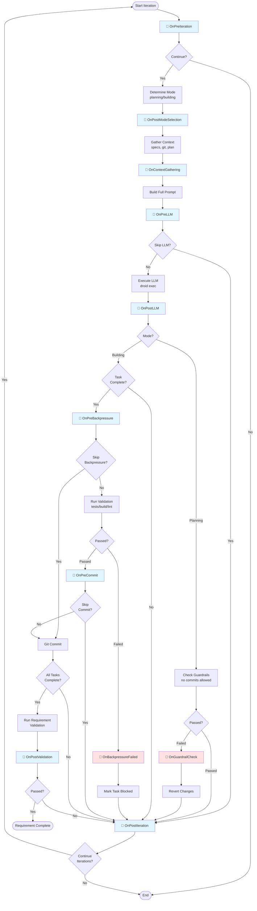

# Felix Plugins

This directory contains plugins that extend Felix's behavior through lifecycle hooks.

## Plugin Hook Flow

This diagram shows when each plugin hook is triggered during a Felix agent iteration:



**Legend:**

- 🔌 **Blue hooks** - Normal execution flow where plugins can enhance or modify behavior

- 🔌 **Red hooks** - Error/failure handling where plugins can react to problems

- **Decision diamonds** - Points where plugin return values can alter the flow

## Directory Structure

Each plugin should be in its own subdirectory:

```

..felix/plugins/

  plugin-name/

    plugin.json           # Manifest file (required)

    on-prediteration.ps1  # Hook script (v1 API)

    on-postllm.ps1        # Hook script (v1 API)

    persistent-state.json # Persistent state (auto-generated)

    README.md             # Plugin documentation

    tests/                # Plugin tests

```

## Plugin Discovery

Felix automatically discovers and loads plugins from this directory during agent startup.

Plugins are loaded in dependency order, then sorted by priority (lower = earlier).

## API Versions

- **v1**: Hook scripts named `on-{hookname}.ps1` (e.g., `on-prediteration.ps1`)

- **v2**: Hook scripts in `hooks/{HookName}.ps1` subdirectory (e.g., `hooks/OnPreIteration.ps1`)

Set `api_version` in config.json to control which API version is used.

## State Management

Plugins can store state in two ways:

1. **Persistent State**: `persistent-state.json` in plugin directory (survives across runs)

2. **Transient State**: `plugin-state-{name}.json` in each run directory (per-run only)

Use the helper functions in felix-agent.ps1:

- `Get-PluginPersistentState` / `Set-PluginPersistentState`

- `Get-PluginTransientState` / `Set-PluginTransientState`

## Circuit Breaker

If a plugin fails repeatedly (default: 3 times), it is automatically disabled for the session.

Adjust `circuit_breaker_max_failures` in config.json to change this threshold.

## Debugging

Check these files for plugin execution details:

- `runs/{runId}/plugin-chain-debug.json` - Hook execution chain

- `runs/{runId}/plugin-execution.json` - Plugin execution metrics

- `runs/{runId}/plugin-state-{name}.json` - Per-plugin transient state

## Example Plugins

See example plugins in this directory for reference implementations.

For a complete guide to writing plugins, see **[docs/PLUGINS.md](../../docs/PLUGINS.md)**.
