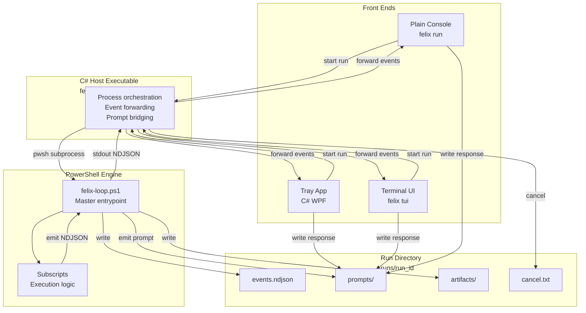

# Felix Local Execution Architecture

One Page Diagram

```
┌──────────────────────────────────────────────────────────────┐
│                          Front Ends                          │
│                                                              │
│  ┌───────────────┐   ┌────────────────┐   ┌────────────────┐ │
│  │ Plain Console │   │ Terminal UI    │   │ Tray App (C#)  │ │
│  │ (felix run)   │   │ (felix tui)    │   │ Background UI  │ │
│  └───────┬───────┘   └──────┬─────────┘   └──────┬─────────┘ │
│          │                  │                    │           │
│          │ NDJSON events    │ NDJSON events      │ NDJSON    │
│          │ + prompts        │ + prompts          │ events    │
└──────────┼──────────────────┼────────────────────┼───────────┘
           │                  │                    │
           ▼                  ▼                    ▼
┌──────────────────────────────────────────────────────────────┐
│                    C# Host Executable                        │
│                        (felix.exe)                           │
│                                                              │
│  Responsibilities:                                           │
│  - Single entrypoint for all local usage                     │
│  - Creates run directory                                     │
│  - Launches PowerShell engine                                │
│  - Reads stdout / stderr                                     │
│  - Forwards structured events (NDJSON)                       │
│  - Wraps unstructured output as log events                   │
│  - Handles cancellation                                      │
│  - Bridges prompt responses back to engine                   │
│                                                              │
│  Commands:                                                   │
│  - felix run <spec>                                          │
│  - felix run <spec> --emit ndjson                            │
│  - felix tui <spec>                                          │
└───────────────────────────────┬──────────────────────────────┘
                                │
                                │ pwsh subprocess
                                │ stdout / stderr
                                ▼
┌──────────────────────────────────────────────────────────────┐
│                PowerShell Execution Engine                   │
│                  (felix-loop.ps1)                            │
│                                                              │
│  - Master entrypoint                                         │
│  - Calls subscripts                                          │
│  - Owns execution logic                                      │
│  - Emits structured events                                   │
│  - Writes artifacts                                          │
│  - Never renders UI                                          │
│  - Never prompts via Read-Host                               │
│                                                              │
│  Uses shared helpers:                                        │
│  - Emit-Event                                                │
│  - Log-Info / Warn / Error                                   │
│  - Progress                                                  │
│  - Prompt-*                                                  │
└───────────────────────────────┬──────────────────────────────┘
                                │
                                │ filesystem
                                ▼
┌──────────────────────────────────────────────────────────────┐
│                        Run Directory                         │
│                                                              │
│  runs/<run_id>/                                              │
│    ├─ events.ndjson                                          │
│    ├─ manifest.json                                          │
│    ├─ artifacts/                                             │
│    ├─ prompts/                                               │
│    │    ├─ <prompt_id>.json                                  │
│    │    └─ <prompt_id>.response.json                         │
│    └─ cancel.txt                                             │
│                                                              │
│  - Single source of truth for run outputs                    │
│  - Enables replay, debugging, and UI reattachment            │
└──────────────────────────────────────────────────────────────┘
```

---

## Key Flows (at a glance)

### Execution

1. Front end starts `felix.exe`
2. Host creates run directory
3. Host launches `felix-loop.ps1`
4. Engine emits NDJSON events
5. Host forwards events to UI

### Prompts

1. Engine emits `prompt` event
2. UI displays prompt
3. UI writes response to run directory
4. Engine resumes

### Cancellation

1. User cancels in UI
2. Host writes `cancel.txt`
3. Engine detects and exits cleanly

---

## Why this diagram matters

- PowerShell stays focused on execution
- C# host is the integration and stability layer
- UIs are thin, replaceable renderers
- Event stream is the contract
- Run directory is the audit trail

---

## Design Decisions

### Error Handling Strategy

**All errors as NDJSON events** - Structured `error_occurred` events in the main stdout stream with full context (requirement_id, run_id, iteration, severity). Only PowerShell interpreter crashes go to stderr (out of our control). This provides a single clean stream for consumers to parse and display prominently.

### Prompt Handling Strategy

**File-based prompts** - Engine writes `runs/{run_id}/prompts/{prompt_id}.json`, polls for `{prompt_id}.response.json` (500ms intervals, 5min timeout). Simple, reliable, cross-platform, survives crashes, provides audit trail. Latency is acceptable since prompts are rare (0-2 per run) and async by nature (humans take seconds to respond).

### Event Emission

**NDJSON to stdout only** - One JSON object per line, no backward compatibility mode. Engine becomes UI-agnostic "black box" that speaks structured JSON. Host parses line-by-line and forwards to appropriate UI.

---

## Implementation Path

### Phase 1: MVP (Weeks 1-4)

1. **Create event emission system** in `.felix/core/emit-event.ps1`
2. **Replace ~210 Write-Host calls** with structured events
3. **Build test CLI consumer** to validate event stream
4. **Complete migration** to 100% NDJSON output

### Phase 2: Host Development (Future)

1. Build C# host executable (`felix.exe`)
2. Implement Terminal UI (TUI) consumer
3. Implement Tray App consumer
4. Add prompt handling infrastructure
5. Add cancellation support

**Current Status:** Planning Phase 1 implementation  
**Next Step:** Create detailed migration plan in ARCHITECTURE_MIGRATION.md

## Flow


