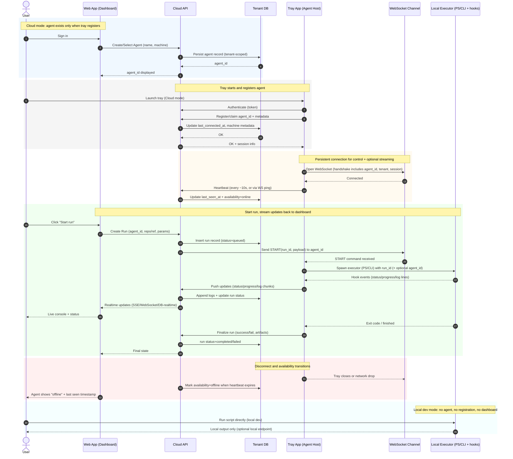

## Core framing

The system must clearly separate **local execution**, **tray-mediated execution**, and **cloud orchestration**. Confusion only arises when those concerns blur.

Key idea
**Nothing “exists” to the web unless it explicitly registers through the tray.**
Scripts can run independently. Agents only exist when surfaced through the app.

---

## Agent model and lifecycle

### No default agent

- The concept of a “default” or “always-on” agent is removed.
- Agents only exist once explicitly created and registered via the tray UI.
- If no agent is registered, nothing can be orchestrated remotely.

Result
Cleaner mental model, fewer edge cases, and no hidden behavior.

---

### Local execution is agentless

- Running a script directly (PowerShell, CLI, dev usage) does not require:
  - agent registration
  - web authentication
  - heartbeats
  - dashboards

- Scripts can optionally accept an `agent_id` parameter:
  - If present, logs can be attributed
  - If absent, execution is anonymous and local

Principle
**Local dev should never require cloud ceremony.**

---

### Tray is the boundary

The tray application is the only component that:

- Registers agents
- Authenticates users
- Establishes persistent connections
- Makes an agent visible to the web dashboard

If you are not running via the tray:

- You are not an agent
- You cannot be controlled or monitored remotely

---

## Local vs cloud mode

The tray supports two explicit modes.

### Cloud mode

- Tray authenticates with the cloud service
- Agent registers to the user’s tenant
- Agent appears in the dashboard
- Server can issue start/stop commands

### Local mode

- Tray connects to a custom endpoint (localhost)
- No authentication required
- No cloud registration
- Same tray UX, but fully local

This avoids branching logic in scripts and keeps behavior consistent.

---

## Agent registration and persistence

- Agents register through the tray, not scripts
- Registration metadata is stored server-side per tenant
- Stored fields include:
  - agent id
  - last connected timestamp
  - last seen / availability status

Even disconnected agents remain visible historically.

---

## Availability and heartbeats

### Availability is explicit

- An agent is only “available” when the tray declares it so
- Availability is not inferred from historical registration

### Heartbeat model

- Heartbeats originate from the tray
- Sent at a regular interval (for example every 10 seconds)
- If heartbeats stop, the agent is marked unavailable

No polling from the server. No health-check spam.

---

## WebSocket usage

### Purpose

WebSockets are used for:

- Server → agent control signals (start, stop)
- Optional real-time streaming (logs, console output)

They are not required for:

- Status updates
- Heartbeats
- Metrics

Those flow client → server over standard requests or realtime DB sync.

---

### Connection behavior

- One WebSocket connection per tray instance
- Connection handshake includes metadata identifying the agent
- Disconnection immediately reflects agent unavailability

This gives instant feedback without polling.

---

### Scalability stance

- Thousands of concurrent WebSockets are acceptable
- Required anyway if server-initiated commands are supported
- If realtime DB sync is used, WebSockets become thinner, not heavier

The system does not prematurely optimize away sockets.

---

## Removal of script-level health checks

- Existing frequent health polling (every ~5 seconds) is eliminated
- Tray state and execution output become the source of truth
- Health endpoints are no longer required for normal operation

Result
Lower noise, lower load, simpler code paths.

---

## Data flow summary

**Tray → Server**

- agent registration
- heartbeats
- execution updates
- logs and progress

**Server → Tray**

- start execution
- stop execution
- optional control messages

**Script**

- executes work
- emits events via plugin hooks
- does not manage connectivity or identity

---

## Configuration ownership

- Global config lives with the tray
- Agents are user-owned and stored in user app data
- Scripts read configuration locally
- The server never assumes local filesystem state

---

## Design principles extracted

1. **Explicit over implicit**
   Nothing exists unless it registers.

2. **Tray as the trust boundary**
   Identity, availability, and control flow through one place.

3. **Local-first ergonomics**
   Dev workflows should not require cloud infrastructure.

4. **Push beats poll**
   Heartbeats and sockets replace health-check loops.

5. **Agent visibility is earned**
   Only authenticated, registered agents can be orchestrated.

6. **History matters**
   Agents persist as records even when offline.

7. **Minimal coupling**
   Scripts know nothing about dashboards, tenants, or sockets.

