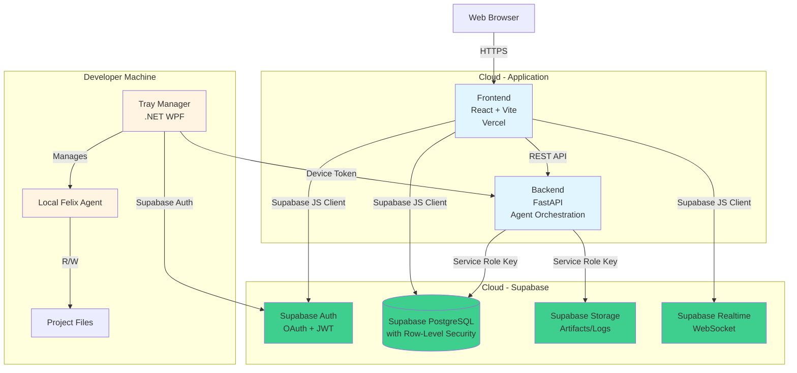
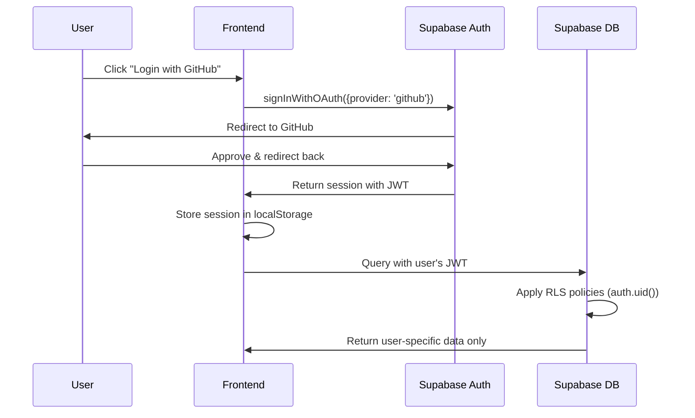
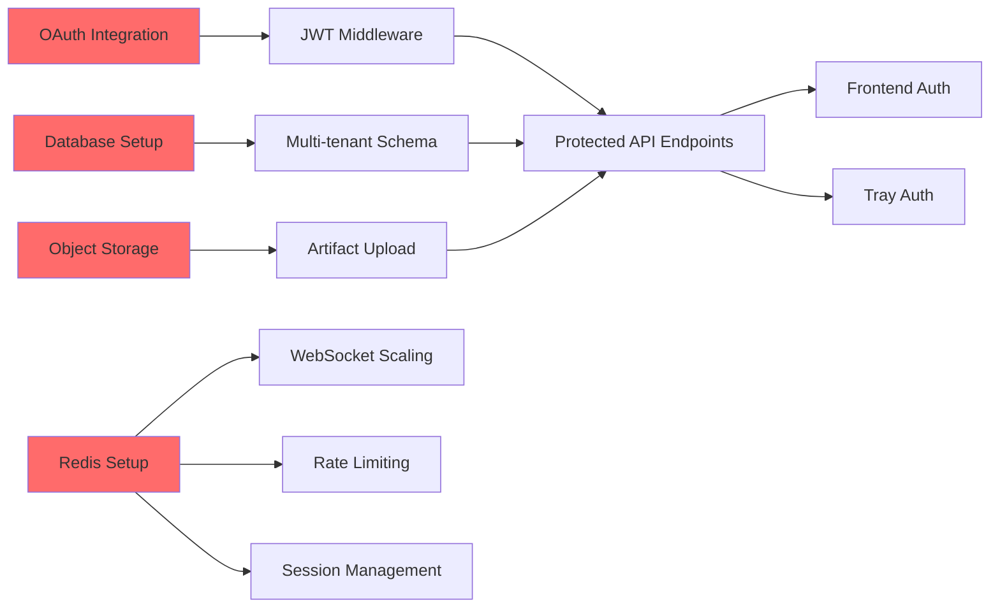
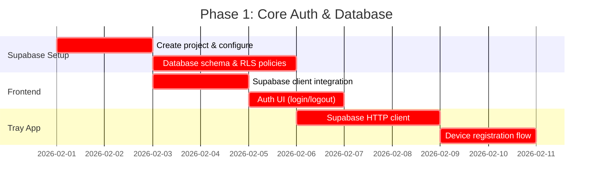

# Felix Production Readiness - SaaS Deployment TODO

## Overview

This document outlines the complete production readiness roadmap for Felix as a SaaS solution using **Supabase** as the backend infrastructure. The architecture consists of:

- **Frontend (React + Vite)**: Cloud-hosted web application (Vercel/Netlify)
- **Backend (FastAPI)**: Lightweight API layer for agent orchestration
- **Supabase**: Managed PostgreSQL, Auth, Storage, and Realtime
- **Tray Manager (.NET WPF)**: Desktop application on developer machines



### Why Supabase?

- ✅ **Built-in Authentication**: OAuth providers, JWT, Row-Level Security (RLS)
- ✅ **Managed PostgreSQL**: Auto-scaling, backups, point-in-time recovery
- ✅ **Object Storage**: S3-compatible storage with CDN
- ✅ **Realtime Subscriptions**: WebSocket connections built-in (replaces custom WebSocket implementation)
- ✅ **Generous Free Tier**: 500MB database, 1GB storage, 2GB bandwidth
- ✅ **Auto-generated REST API**: Instant CRUD APIs with RLS
- ✅ **Edge Functions**: Optional serverless functions if needed

---

## 1. Authentication & Authorization with Supabase

### 1.1 User Authentication (Frontend & Backend)

**Priority**: 🔴 CRITICAL

#### Tasks

- [ ] **Set up Supabase project and configure Auth providers**
  - Enable GitHub, Google, Microsoft OAuth in Supabase dashboard
  - Configure redirect URLs for production domain
  - Copy Supabase URL and anon key to frontend environment
  
- [ ] **Frontend Supabase Auth integration**
  - Install `@supabase/supabase-js` package
  - Initialize Supabase client with project URL and anon key
  - Implement login/logout UI using Supabase Auth methods
  - Add auth state listener and context provider
  - Session auto-refresh handled by Supabase client
  
- [ ] **Backend Supabase integration** (minimal - mostly for agent orchestration)
  - Install `supabase` Python client
  - Use service role key for admin operations
  - Validate JWT tokens from Supabase in FastAPI middleware (optional - can skip if backend only handles agent orchestration)
  
- [ ] **Row-Level Security (RLS) policies**
  - Enable RLS on all tables in Supabase dashboard
  - Create policies to ensure users only access their own data
  - Use `auth.uid()` in RLS policies for automatic filtering



### 1.2 Tray Application Authentication

**Priority**: 🔴 CRITICAL

#### Tasks

- [ ] **Device registration flow**
  - Generate unique device ID on first launch
  - Implement device approval workflow in web UI
**Supabase Approach**: Tray app authenticates using Supabase Auth, then registers device

#### Tasks

- [ ] **Implement Supabase Auth in C# .NET**
  - Use HTTP client to call Supabase Auth REST API
  - Implement device code flow or magic link authentication
  - Store Supabase session tokens in Windows Credential Manager
  
- [ ] **Device registration in Supabase**
  - Create `devices` table in Supabase with RLS
  - On first launch, register device with user's account
  - Store device metadata (name, fingerprint, last_seen)
  
- [ ] **Device approval workflow**
  - New devices start as `pending` status
  - User approves devices in web UI
  - Tray app polls for approval status
  
- [ ] **Project access control**
  - Create `project_device_access` junction table
  - Users grant specific devices access to specific projects
  - Tray app queries accessible projects via Supabase client

```csharp
// Example: Supabase Auth in C#
using System.Net.Http;
using System.Text.Json;
using Windows.Security.Credentials;

public class SupabaseAuthService 
{
    private const string SupabaseUrl = "https://your-project.supabase.co";
    private const string SupabaseAnonKey = "your-anon-key";
    private readonly HttpClient _httpClient;
    
    public SupabaseAuthService() 
    {
        _httpClient = new HttpClient();
        _httpClient.DefaultRequestHeaders.Add("apikey", SupabaseAnonKey);
    }
    
    public async Task<string> SignInWithMagicLink(string email) 
    {
        var payload = new { email };
        var response = await _httpClient.PostAsJsonAsync(
            $"{SupabaseUrl}/auth/v1/magiclink", 
            payload
        );
        response.EnsureSuccessStatusCode();
        return "Check your email for the magic link";
    }
    Supabase Database Setup

### 2.1 Database Schema & Migration

**Priority**: 🔴 CRITICAL

**Current State**: File-based storage (`~/..felix/projects.json`, `~/..felix/agents.json`)

**Supabase Approach**: Use Supabase dashboard SQL editor or migrations

#### Tasks

- [ ] **Create Supabase database schema**
  - Run SQL migrations in Supabase SQL editor
  - Users table auto-created by Supabase Auth (`auth.users`)
  - Create tables for projects, devices, runs, requirements
  
- [ ] **Multi-tenancy schema with RLS**
  ```sql
  -- Projects table
  CREATE TABLE public.projects (
      id UUID PRIMARY KEY DEFAULT gen_random_uuid(),
      user_id UUID REFERENCES auth.users(id) ON DELETE CASCADE NOT NULL,
      name VARCHAR(255) NOT NULL,
      path TEXT NOT NULL,
      created_at TIMESTAMPTZ DEFAULT NOW(),
      updated_at TIMESTAMPTZ DEFAULT NOW(),
      UNIQUE(user_id, name)
  );
  
  -- Enable RLS
  ALTER TABLE public.projects ENABLE ROW LEVEL SECURITY;
  
  -- RLS Policy: Users can only see their own projects
  CREATE POLICY "Users can view own projects"
      ON public.projects FOR SELECT
      USING (auth.uid() = user_id);
  
  CREATE POLICY "Users can insert own projects"
      ON public.projects FOR INSERT
      WITH CHECK (auth.uid() = user_id);
  
  CREATE POLICY "Users can update own projects"
      ON public.projects FOR UPDATE
      USING (auth.uid() = user_id);
  
  -- Devices table
  CREATE TABLE public.devices (
      id UUID PRIMARY KEY DEFAULT gen_random_uuid(),
      user_id UUID REFERENCES auth.users(id) ON DELETE CASCADE NOT NULL,
      device_name VARCHAR(255) NOT NULL,
      device_fingerprint TEXT,
      approved BOOLEAN DEFAULT FALSE,
      created_at TIMESTAMPTZ DEFAULT NOW(),
      last_seen TIMESTAMPTZ DEFAULT NOW()
  );
  
  ALTER TABLE public.devices ENABLE ROW LEVEL SECURITY;
  
  CREATE POLICY "Users can view own devices"
      ON public.devices FOR SELECT
      USING (auth.uid() = user_id);
  
  CREATE POLICY "Users can insert own devices"
      ON public.devices FOR INSERT
      WITH CHECK (auth.uid() = user_id);
  
  -- Project access control
  CREATE TABLE public.project_device_access (
      id UUID PRIMARY KEY DEFAULT gen_random_uuid(),
      project_id UUID REFERENCES public.projects(id) ON DELETE CASCADE,
      device_id UUID REFERENCES public.devices(id) ON DELETE CASCADE,
      granted_at TIMESTAMPTZ DEFAULT NOW(),
      UNIQUE(project_id, device_id)
  );
  
  ALTER TABLE public.project_device_access ENABLE ROW LEVEL SECURITY;
  
  -- Runs table
  CREATE TABLE public.runs (
      id UUID PRIMARY KEY DEFAULT gen_random_uuid(),
      project_id UUID REFERENCES public.projects(id) ON DELETE CASCADE,
      requirement_id VARCHAR(50),
      started_at TIMESTAMPTZ DEFAULT NOW(),
      completed_at TIMESTAMPTZ,
      status VARCHAR(50),
      output_log TEXT,
      diff_patch TEXT,
      created_at TIMESTAMPTZ DEFAULT NOW()
  );
  
  ALTER TABLE public.runs ENABLE ROW LEVEL SECURITY;
  
  CREATE POLICY "Users can view runs for their projects"
      ON public.runs FOR SELECT
      USING (
        Supabase Storage (Artifacts & Logs)

**Priority**: 🔴 CRITICAL

**Current State**: Local filesystem (`runs/`, `specs/`, project files)

**Supabase Approach**: Use Supabase Storage with RLS policies

#### Tasks

- [ ] **Set up Supabase Storage buckets**
  - Create `project-artifacts` bucket in Supabase dashboard
  - Enable RLS on the bucket
  - Configure bucket policies for user-specific access
  
- [ ] **Upload artifacts from tray app & backend**
  - Use Supabase Storage API to upload run artifacts (plans, logs, diffs)
  - Organize by path: `{user_id}/{project_id}/runs/{run_id}/{filename}`
  - Set appropriate content types and caching headers
  
- [ ] **Storage RLS policies**
  - Users can only upload to their own folders
  - Users can only read their own artifacts
  - Automatic cleanup via Supabase Storage lifecycle policies
  
- [ ] **Frontend access to artifacts**
  - Generate signed URLs for secure downloads
  - Display artifacts in web UI
  - Implement artifact viewer for logs and diffs

```python
# Example: Supabase Storage in Python backend
from supabase import create_client, Client

class SupabaseArtifactStorage:
    def __init__(self):
        self.supabase: Client = create_client(
            supabase_url=os.getenv("SUPABASE_URL"),
            supabase_key=os.getenv("SUPABASE_SERVICE_ROLE_KEY")
        )
        self.bucket_name = "project-artifacts"
    
    async def upload_run_artifact(
        self, 
        user_id: str,
        project_id: str, 
        run_id: str, 
        filename: str, 
        content: bytes
    ) -> str:
        path = f"{user_id}/{project_id}/runs/{run_id}/{filename}"
        
        self.supabase.storage.from_(self.bucket_name).upload(
            path=path,
            file=content,
            file_options={"content-type": "text/plain"}
        )
        Realtime Updates with Supabase

**Priority**: 🟡 HIGH

**Current State**: Custom WebSocket implementation in FastAPI

**Supabase Approach**: Use Supabase Realtime for database change subscriptions

#### Tasks

- [ ] **Replace custom WebSocket with Supabase Realtime**
  - Frontend subscribes to database changes using Supabase JS client
  - Listen to `INSERT`, `UPDATE`, `DELETE` on `runs`, `requirements`, `projects`
  - RLS policies automatically filter realtime events per user
  
- [ ] **Frontend realtime subscription**
  - Subscribe to project-specific channels
  - Auto-update UI when runs/requirements change
  - Handle reconnection automatically (built into Supabase client)
  
- [ ] **Optional: Keep FastAPI WebSocket for agent-specific events**
  - Use Supabase Realtime for database changes
  - Use FastAPI WebSocket only for live agent output streaming (if needed)
  - Authenticate WebSocket with Supabase JWT

```typescript
// Example: Supabase Realtime in React frontend
import { useEffect } from 'react';
import { supabase } from './supabaseClient';

function useProjectRuns(projectId: string) {
  const [runs, setRuns] = useState([]);
  
  useEffect(() => {
    // Initial fetch
    const fetchRuns = async () => {
      const { data } = await supabase
        .from('runs')
        .select('*')
        .eq('project_id', projectId)
        .order('started_at', { ascending: false });
      
      setRuns(data || []);
    };
    
    fetchRuns();
    
    // Subscribe to realtime changes
    const subscription = supabase
      .channel(`project:${projectId}:runs`)
      .on(
        'postgres_changes',
        {
          event: '*',
          schema: 'public',
          table: 'runs',
          filter: `project_id=eq.${projectId}`
        },
        (payload) => {
          console.log('Run updated:', payload);
          // Update local state
          if (payload.eventType === 'INSERT') {
            setRuns((prev) => [payload.new, ...prev]);
          } else if (payload.eventType === 'UPDATE') {
            setRuns((prev) =>
              prev.map((run) =>
                run.id === payload.new.id ? payload.new : run
              )
            );
          }
        }
      )
      .subscribe();
    
    return () => {
      subscription.unsubscribe();
    };
  }, [projectId]);
  
  return runs;
}
```

**Benefits over custom WebSocket:**
- ✅ No Redis needed for pub/sub
- ✅ Automatic scaling (managed by Supabase)
- ✅ RLS filtering built-in
- ✅ Reconnection handling automatic
- ✅ Works across multiple frontend instances
class ArtifactStorage:
    def __init__(self, bucket_name: str):
        self.s3 = boto3.client('s3')
        self.bucket = bucket_name
    
    async def upload_run_artifact(
        self, 
        project_id: str, 
        run_id: str, 
        filename: str,  with Supabase

**Priority**: 🟡 HIGH

#### Tasks

- [ ] **Supabase project setup**
  - Create production Supabase project (separate from development)
  - Copy Supabase URL and keys to environment variables
  - Configure custom domain for Supabase API (optional)
  
- [ ] **Environment variables**
  - Frontend: `VITE_SUPABASE_URL`, `VITE_SUPABASE_ANON_KEY`
  - Backend: `SUPABASE_URL`, `SUPABASE_SERVICE_ROLE_KEY`
  - Tray app: Fetch Supabase config from backend or config file
  
- [ ] **CORS configuration**
  - Add production frontend domain to Supabase allowed origins
  - Supabase handles CORS automatically for configured domains
  - No need for custom CORS middleware in backend

```python
# backend/config.py - Simplified with Supabase
import os
from pydantic_settings import BaseSettings

class Settings(BaseSettings):
    # Supabase
    supabase_url: str = os.getenv("SUPABASE_URL")
    supabase_service_role_key: str = os.getenv("SUPABASE_SERVICE_ROLE_KEY")
    
    # FastAPI
    api_host: str = os.getenv("API_HOST", "0.0.0.0")
    api_port: int = int(os.getenv("API_PORT", "8080"))
    
    # Feature flags
    copilot_enabled: bool = os.getenv("COPILOT_ENABLED", "true").lower() == "true"
    
    class Config:
        env_file = ".env"

settings = Settings()
```

```bash
# .env.example
# Supabase Configuration
SUPABASE_URL=https://your-project.supabase.co
SUPABASE_SERVICE_ROLE_KEY=your-service-role-key

# Frontend (for Vite)
VITE_SUPABASE_URL=https://your-project.supabase.co
VITE_SUPABASE_ANON_KEY=your-anon-key

# OptionSecurity (Simplified with Supabase)

**Priority**: 🔴 CRITICAL

**Supabase handles most security automatically:**
- ✅ Rate limiting built-in (configurable in dashboard)
- ✅ HTTPS/SSL automatic on all Supabase endpoints
- ✅ Row-Level Security for data isolation
- ✅ JWT validation automatic

#### Tasks

- [ ] **Configure Supabase rate limiting**
  - Set rate limits in Supabase dashboard (requests per second)
  - Default: 100 requests/second on free tier
  - Upgrade for higher limits
  
- [ ] **Backend API security** (for FastAPI endpoints)
  - Validate Supabase JWT if backend needs auth
  - Add security headers middleware
  - Input validation with Pydantic (already in place)
  
- [ ] **HTTPS enforcement**
  - Deploy backend to platform with automatic HTTPS (Render, Railway, Fly.io)
  - Frontend on Vercel/Netlify has automatic HTTPS
  - No manual SSL certificate management needed
  
- [ ] **API versioning**
  - Implement `/api/v1/` prefix for backend endpoints
  - Supabase auto-generated API is already versioned

```python
# Minimal security middleware for FastAPI
from fastapi import Request
from fastapi.middleware.cors import CORSMiddleware

@app.middleware("http")
async def security_headers(request: Request, call_next):
    response = await call_next(request)
    response.headers["X-Frame-Options"] = "DENY"
    response.headers["X-Content-Type-Options"] = "nosniff"
    response.headers["Strict-Transport-Security"] = "max-age=31536000"
    return response

# CORS (allow frontend domain)
app.add_middleware(
    CORSMiddleware,
    allow_origins=[
        "https://felix.yourdomain.com",
        "http://localhost:3000"  # Development only
    ],
    allow_credentials=True,
    allow_methods=["*"],
    allow_headers=["*"],
)
    database_url: str = os.getenv("DATABASE_URL", "postgresql://...")
    
    # Redis
    redis_url: str = os.getenv("REDIS_URL", "redis://localhost:6379")
    
    # Object Storage
    s3_bucket: str = os.getenv("S3_BUCKET", "felix-artifacts")
    aws_region: str = os.getenv("AWS_REGION", "us-east-1")
    
    # Auth
    jwt_secret: str = os.getenv("JWT_SECRET")
    jwt_algorithm: str = "HS256"
    jwt_expiration_hours: int = 24
    
    # CORS
    allowed_origins: list = os.getenv("ALLOWED_ORIGINS", "").split(",")
    
    # Feature flags
    copilot_enabled: bool = os.getenv("COPILOT_ENABLED", "true").lower() == "true"
    
    class Config:
        env_file = ".env"

settings = Settings()
```

### 2.5 API Security

**Priority**: 🔴 CRITICAL

#### Tasks

- [ ] **Rate limiting**
  - Implement per-user and per-IP rate limits
  - Use Redis for distributed rate limiting
  - Return proper 429 status codes
  
- [ ] **Input validation**
  - Validate all request bodies with Pydantic
  - Sanitize file paths to prevent directory traversal
  - Limit request body sizes
  
- [ ] **HTTPS enforcement**
  - Configure SSL/TLS certificates (Let's Encrypt or cloud provider)
  - Redirect HTTP → HTTPS
  - Implement HSTS headers
  
- [ ] **Security headers**
  - Add CSP (Content Security Policy)
  - X-Frame-Options: DENY
  - X-Content-Type-Options: nosniff
  
- [ ] **API versioning**
  - Implement `/api/v1/` prefix
  - Plan for backward compatibility

```python
from fastapi import Request, HTTPException
from slowapi import Limiter
from slowapi.util import get_remote_address

limiter = Limiter(key_func=get_remote_address)

@app.middleware("http")
async def security_headers(request: Request, call_next):
    response = await call_next(request)
    response.headers["X-Frame-Options"] = "DENY"
    response.headers["X-Content-Type-Options"] = "nosniff"
    response.headers["Strict-Transport-Security"] = "max-age=31536000; includeSubDomains"
    response.headers["Content-Security-Policy"] = "default-src 'self'"
    return response

@app.get("/api/v1/projects")
@limiter.limit("100/minute")
async def list_projects(request: Request, user: User = Depends(get_current_user)):
    # ... implementation
```

## 3. Frontend Cloud Readiness (Simplified)

### 3.1 Build & Deployment to Vercel/Netlify

**Priority**: 🟡 HIGH

**Recommended**: Deploy to Vercel or Netlify for automatic HTTPS, CDN, and zero-config deployment

#### Tasks

- [ ] **Production build optimization**
  - Configure Vite for production builds
  - Enable code splitting and lazy loading
  - Optimize bundle size (tree shaking already enabled by Vite)
  
- [ ] **Environment configuration**
  - Create `.env.production` with Supabase production credentials
  - Remove any hardcoded localhost URLs
  - Use `import.meta.env` for environment variables
  
- [ ] **Deploy to Vercel**
  - Connect GitHub repo to Vercel
  - Set environment variables in Vercel dashboard
  - Automatic deployments on git push
  - Preview deployments for pull requests
  
  OR
  
- [ ] **Deploy to Netlify**
  - Connect GitHub repo to Netlify
  - Configure build command: `npm run build`
  - Set publish directory: `dist`
  - Add environment variables in Netlify UI
  
- [ ] **Error tracking (optional)**
  - Integrate Sentry for error tracking
  - Add Sentry DSN to environment variables

```typescript
// src/lib/supabaseClient.ts
import { createClient } from '@supabase/supabase-js';

const supabaseUrl = import.meta.env.VITE_SUPABASE_URL;
const supabaseAnonKey = import.meta.env.VITE_SUPABASE_ANON_KEY;

if (!supabaseUrl || !supabaseAnonKey) {
  throw new Error('Missing Supabase environment variables');
}

export const supabase = createClient(supabaseUrl, supabaseAnonKey);
```

```bash
# .env.production
VITE_SUPABASE_URL=https://your-production-project.supabase.co
VITE_SUPABASE_ANON_KEY=your-production-anon-key
VITE_API_URL=https://api.felix.yourdomain.com
```

### 3.2 Authentication Integration

**Priority**: 🔴 CRITICAL

#### Tasks

- [ ] **Install Supabase JS client**
  ```bash
  npm install @supabase/supabase-js
  ```

- [ ] **Auth context provider**
  - Create React context for Supabase auth
  - Auto-refresh sessions handled by Supabase
  - Persist session in localStorage (automatic)
  
- [ ] **Protected routes**
  - Wrap routes with auth guard
  - Redirect unauthenticated users to login
  
- [ ] **Login UI**
  - Add OAuth provider buttons (GitHub, Google)
  - Handle OAuth redirect flow
  - Show loading states

```typescript
// src/contexts/AuthContext.tsx
import { createContext, useContext, useEffect, useState } from 'react';
import { User, Session } from '@supabase/supabase-js';
import { supabase } from '../lib/supabaseClient';

interface AuthContextType {
  user: User | null;
  session: Session | null;
  signInWithGithub: () => Promise<void>;
  signOut: () => Promise<void>;
  loading: boolean;
}

const AuthContext = createContext<AuthContextType | undefined>(undefined);

export function AuthProvider({ children }: { children: React.ReactNode }) {
  const [user, setUser] = useState<User | null>(null);
  const [session, setSession] = useState<Session | null>(null);
  const [loading, setLoading] = useState(true);
  
  useEffect(() => {
    // Get initial session
    supabase.auth.getSession().then(({ data: { session } }) => {
      setSession(session);
      setUser(session?.user ?? null);
      setLoading(false);
    });
    
    // Listen for auth changes
    const {
      data: { subscription },
    } = supabase.auth.onAuthStateChange((_event, session) => {
      setSession(session);
      setUser(session?.user ?? null);
    });
    
    return () => subscription.unsubscribe();
  }, []);
  
  const signInWithGithub = async () => {
    await supabase.auth.signInWithOAuth({
      provider: 'github',
      options: {
        redirectTo: `${window.location.origin}/auth/callback`,
      },
    });
  };
  
  const signOut = async () => {
    await supabase.auth.signOut();
  };
  
  return (
    <AuthContext.Provider value={{ user, session, signInWithGithub, signOut, loading }}>
      {children}
    </AuthContext.Provider>
  );
}

export const useAuth = () => {
  const context = useContext(AuthContext);
  if (!context) throw new Error('useAuth must be used within AuthProvider');
  return context;
};
```

---

## 4. Tray Manager Production Enhancements (Simplified)

### 4.1 Supabase Integration in C#

**Priority**: 🔴 CRITICAL

#### Tasks

- [ ] **Install Supabase C# client**
  ```bash
  dotnet add package supabase-csharp
  # OR use HTTP client with Supabase REST API
  ```

- [ ] **Device authentication flow**
  - Generate device ID on first launch
  - Authenticate user with Supabase (magic link or device code flow)
  - Register device in Supabase database
  - Store Supabase session in Windows Credential Manager
  
- [ ] **HTTPS communication**
  - All Supabase endpoints use HTTPS by default
  - No custom SSL configuration needed
  - Certificate validation automatic

```csharp
// Services/SupabaseService.cs
using System.Net.Http;
using System.Text.Json;
using Windows.Security.Credentials;

public class SupabaseService
{
    private readonly HttpClient _httpClient;
    private const string SupabaseUrl = "https://your-project.supabase.co";
    private const string SupabaseAnonKey = "your-anon-key";
    
    public SupabaseService()
    {
        _httpClient = new HttpClient();
        _httpClient.DefaultRequestHeaders.Add("apikey", SupabaseAnonKey);
    }
    
    // Step 1: Request magic link for device authentication
    public async Task<bool> RequestMagicLinkAsync(string email)
    {
        var payload = new { email };
        var response = await _httpClient.PostAsJsonAsync(
            $"{SupabaseUrl}/auth/v1/magiclink", 
            payload
        );
        
        return response.IsSuccessStatusCode;
    }
    
    // Step 2: After user clicks magic link, get session
    public async Task<Session> GetSessionAsync(string accessToken)
    {
        _httpClient.DefaultRequestHeaders.Authorization = 
            new System.Net.Http.Headers.AuthenticationHeaderValue("Bearer", accessToken);
        
        var response = await _httpClient.GetAsync($"{SupabaseUrl}/auth/v1/user");
        response.EnsureSuccessStatusCode();
        
        var session = await response.Content.ReadFromJsonAsync<Session>();
        StoreSession(session);
        
        // Step 3: Register this device
        await RegisterDeviceAsync(session);
        
        return session;
    }
    
    // Register device in Supabase database
    private async Task RegisterDeviceAsync(Session session)
    {
        var deviceData = new
        {
            device_name = Environment.MachineName,
            device_fingerprint = GetDeviceFingerprint(),
            approved = false // Will be approved by user in web UI
        };
        
        _httpClient.DefaultRequestHeaders.Authorization = 
            new System.Net.Http.Headers.AuthenticationHeaderValue("Bearer", session.AccessToken);
        
        var response = await _httpClient.PostAsJsonAsync(
            $"{SupabaseUrl}/rest/v1/devices",
            deviceData& Updates

**Priority**: 🟡 HIGH

#### Tasks

- [ ] **Supabase configuration**
  - Store Supabase URL in app settings (can be updated via config file)
  - OR: Hardcode production Supabase URL (simpler for first version)
  - Support environment switching (dev/prod)
  
- [ ] **Auto-update mechanism**
  - Use ClickOnce deployment (easiest for .NET apps)
  - OR: Publish releases on GitHub and check for updates
  - Download and install updates automatically
  
- [ ] **Logging**
  - Implement Serilog for structured logging
  - Log to file and optionally to Supabase (via Edge Function)
  - Include device ID in all logs

```csharp
// App.config or appsettings.json
{
  "Supabase": {
    "Url": "https://your-project.supabase.co",
    "AnonKey": "your-anon-key"
  },
  "UpdateCheckUrl": "https://api.github.com/repos/yourusername/.felix/releases/latest"= Environment.MachineName;
        var username = Environment.UserName;
        
        using var sha = System.Security.Cryptography.SHA256.Create();
        var hash = sha.ComputeHash(
            System.Text.Encoding.UTF8.GetBytes($"{machineId}:{username}")
        );
        return Convert.ToBase64String(hash);
    }
}

public class Session
{
    public string AccessToken { get; set; }
    public string RefreshToken { get; set; }
    public User User { get; set; }
}
```

### 4.2 Configuration Management

**Priority**: 🟡 HIGH

#### Tasks

- [ ] **Remote configuration**
  - Fetch API endpoint from cloud (not hardcoded)
  - Support configuration updates without reinstall
  - Implement configuration caching
  Authentication UX**
  - Show "Login Required" dialog on first launch
  - Display magic link email prompt
  - Show success message after authentication
  
- [ ] **Device approval workflow**
  - Show "Waiting for approval" status
  - Poll Supabase for device approval (check `approved` field)
  - Guide user to web UI to approve device
  - Show notification when approved
  
- [ ] **Connection status**
  - Show online/offline indicator (check Supabase connectivity)
  - Display last sync time
  - Auto-reconnect when network recovers OnStartup(StartupEventArgs e)
{
    base.OnStartup(e);
    
    // Check for updates
    var updateService = new UpdateService();
    if (await updateService.CheckForUpdatesAsync())
    {
        var result = MessageBox.Show(
            "A new version is available. Update now?",
            "Update Available",
            MessageBoxButton.YesNo
        );
        
        if (result == MessageBoxResult.Yes)
        {
            await updateService.DownloadAndInstallAsync();
            Shutdown();
            return;
        }
    }
    
    // Continue normal startup
    var mainWindow = new MainWindow();
    mainWindow.Show();
}
```

### 4.3 User Experience

**Priority**: 🟢 MEDIUM

#### Tasks

- [ ] **Connection status indicator**
  - Show online/offline status in tray icon
  - Display connection errors to user
  - Auto-reconnect on network recovery
  
- [ ] **Device approval workflow**
  - Show "waiting for approval" message
  - Poll for approval status
  - Guide user to web UI for approval
  
- [ ] **Project sync status**
  - Show upload/download progress
  - Display sync errors
  - Allow manual sync trigger

---

## 5. DevOps & Infrastructure (Simplified with Supabase)

### 5.1 Deployment Architecture

**Priority**: 🟡 HIGH

**Recommended Stack:**
- **Frontend**: Vercel or Netlify (automatic HTTPS, CDN, git-based deployment)
- **Backend**: Render, Railway, or Fly.io (simple deployment, automatic HTTPS)
- **Database/Auth/Storage**: Supabase (fully managed, no DevOps required)

#### Tasks

- [ ] **Backend deployment**
  - Create `Dockerfile` for FastAPI backend (optional - many platforms support Python directly)
  - Deploy to Render/Railway/Fly.io
  - Set environment variables (SUPABASE_URL, SUPABASE_SERVICE_ROLE_KEY)
  - Configure auto-deployment from git
  
- [ ] **Frontend deployment**
  - Connect GitHub repo to Vercel/Netlify
  - Configure build settings (auto-detected for Vite)
  - Add environment variables in dashboard
  - Custom domain setup (optional)

```dockerfile
# Optional Dockerfile for backend (if needed)
FROM python:3.11-slim

WORKDIR /app

COPY app/backend/requirements.txt .
RUN pip install --no-cache-dir -r requirements.txt

COPY app/backend/ .

# Create non-root user
RUN useradd -m -u 1000 felix && chown -R felix:felix /app
USER felix

EXPOSE 8080

CMD ["uvicorn", "main:app", "--host", "0.0.0.0", "--port", "8080"]
```

**Platform Comparison:**

| Platform | Pros | Cons | Cost (Free Tier) |
|----------|------|------|------------------|
| **Render** | Easy setup, automatic HTTPS, PostgreSQL included | Slower cold starts on free tier | 750 hrs/month |
| **Railway** | Great DX, automatic deploys, built-in observability | No free tier anymore | $5/month minimum |
| **Fly.io** | Fast edge deployment, generous free tier | Slightly more complex setup | 3 VMs free |

### 5.2 CI/CD Pipeline (Simplified)

**Priority**: 🟢 MEDIUM

**Note**: Vercel/Netlify handle frontend CI/CD automatically. Backend platforms also support auto-deploy from git.

#### Tasks

- [ ] **GitHub Actions for testing only**
  - Run tests on PR (no deployment - platforms handle that)
  - Build verification
  - Tray app build check

```yaml
# .github/workflows/test.yml
name: Run Tests

on: [pull_request, push]

jobs:
  test-backend:
    runs-on: ubuntu-latest
    steps:
      - uses: actions/checkout@v3
      - uses: actions/setup-python@v4
        with:
          python-version: '3.11'
      - run: pip install -r app/backend/requirements.txt
      - run: pytest app/backend/tests/
  
  test-frontend:
    runs-on: ubuntu-latest
    steps:
      - uses: actions/checkout@v3
      - uses: actions/setup-node@v3
        with:
          node-version: '20'
      - working-directory: app/frontend
        run: |
          npm ci
          npm test
  
  build-tray:
    runs-on: windows-latest
    steps:
      - uses: actions/checkout@v3
      - uses: actions/setup-dotnet@v3
        with:
          dotnet-version: '8.0'
      - run: dotnet build app/tray-manager/FelixTrayApp.csproj -c Release
```

### 5.3 Monitoring & Observability

**Priority**: � MEDIUM

**Supabase provides built-in monitoring** for database, auth, and storage. For application-level monitoring:

#### Tasks

- [ ] **Supabase dashboard monitoring**
  - Use built-in Supabase dashboard for database metrics
  - Monitor API requests, database connections, storage usage
  - Set up billing alerts
  
- [ ] **Application monitoring (optional)**
  - Frontend: Vercel Analytics (built-in) or Sentry
  - Backend: Render/Railway built-in metrics or Sentry
  - Track error rates, response times
  
- [ ] **Health checks**
  - Backend `/health` endpoint (already exists)
  - Supabase automatic health monitoring
  
- [ ] **Logging**
  - Frontend: Console errors to Sentry
  - Backend: stdout logs (captured by platform)
  - Supabase: Query logs in dashboard

**Recommended minimal setup:**
- ✅ Supabase dashboard (free, built-in)
- ✅ Vercel/Netlify analytics (free, built-in)
- ✅ Sentry free tier for error tracking (optional, recommended)

---

## 6. Compliance & Security (Simplified)

### 6.1 Data Privacy

**Priority**: 🟡 HIGH

#### Tasks

- [ ] **GDPR compliance basics**
  - Add privacy policy page
  - Implement data export (Supabase dashboard supports this)
  - Implement account deletion (deletes cascade automatically with RLS)
  - Add cookie consent banner if needed
  
- [ ] **Data encryption**
  - ✅ Supabase encrypts data at rest automatically
  - ✅ HTTPS/TLS for data in transit (automatic)
  - ✅ No additional work needed
  
- [ ] **Terms of Service**
  - Add ToS page
  - Users accept ToS on signup

### 6.2 Subscription Management (Future)

---

## 7. Performance & Scalability

### 7.1 Database Optimization

**Priority**: 🟡 HIGH

#### Tasks

- [ ] **Indexing strategy**
  - Add indexes on frequently queried columns (user_id, project_id)
  - Composite indexes for complex queries
  - Regularly analyze query performance
  
- [ ] **Query optimization**
  - Use connection pooling
  - Implement pagination for large result sets
  - Use database views for complex aggregations
  
- [ ] **Caching strategy**
  - Cache frequently accessed data in Redis
  - Implement cache invalidation on updates
  - Set appropriate TTLs

### 7.2 API Performance

**Priority**: 🟡 HIGH

#### Tasks

- [ ] **Response optimization**
  - Implement compression (gzip)
  - Use ETags for conditional requests
  - Implement GraphQL or similar for flexible queries
  
- [ ] **Async processing**
  - Use background tasks for long-running operations
  - Implement job queue (Celery + Redis)
  - Provide job status endpoints

### 7.3 Frontend Performance

**Priority**: 🟢 MEDIUM

#### Tasks

- [ ] **Code splitting**
  - Lazy load routes
  - Split vendor bundles
  - Implement dynamic imports
**Priority**: 🟢 LOW (Future enhancement)

- [ ] Integrate Stripe for payments
- [ ] Track usage with Supabase (project count, device count, storage)
- [ ] Implement usage limits based on tier

---

## 7. Testing & Quality (Minimal for MVP)

### 7.1 Automated Testing

**Priority**: 🟡 HIGH

#### Tasks

- [ ] **Backend tests**
  - Unit tests for critical business logic
  - Integration tests for Supabase queries
  - Target 60%+ code coverage for MVP
  
- [ ] **Frontend tests**
  - Unit tests for key components
  - E2E tests for auth flow
  
- [ ] **Tray app tests**
  - Unit tests for view models
  - Manual testing of device registration flow

### 7.2 Security Testing

**Priority**: 🔴 CRITICAL

#### Tasks

- [ ] **RLS policy testing**
  - Verify users can't access other users' data
  - Test with multiple accounts
  - Check all CRUD operations
  
- [ ] **Dependency scanning**
  - Use Dependabot (automatic in GitHub)
  - Review and update dependencies monthly
  
- [ ] **Basic security audit**
  - Test authentication flows
  - Verify HTTPS everywhere
  - Check for exposed secrets

---

## 8. Documentation (Minimal for Launch)

### 8.1 User Documentation

**Priority**: 🟢 MEDIUM

#### Tasks

- [ ] **Getting started guide**
  - How to sign up and authenticate
  - How to set up tray app
  - How to connect first project
  
- [ ] **FAQ**
  - Common questions
  - Troubleshooting guide

### 8.2 Developer Documentation

**Priority**: 🟢 LOW

- [ ] API documentation (FastAPI auto-generates `/docs`)
- [ ] Database schema documentation
- [ ] Deployment guide
- Security audit
- Beta testing program

---

## Critical Dependencies



## Success Metrics

Track these metrics to ensure production readiness:

| Metric | Target | Status |
|--------|--------|--------|
| API uptime | > 99.9% | ⏳ Not measured |
| Average response time | < 200ms | ⏳ Not measured |
| Authentication success rate | > 99% | ⏳ Not implemented |
| WebSocket connection stability | < 1% disconnects/hr | ⏳ Not measured |
| Security vulnerabilities | 0 critical, 0 high | ⏳ Not scanned |
| Test coverage | > 80% | ⏳ Needs improvement |
| Documentation completeness | 100% API documented | ⏳ Not started |
| Average support response time | < 24 hours | ⏳ No support system |

---

## 12. Risk Assessment (Updated with Supabase)on Roadmap (Streamlined with Supabase)

### Phase 1: Foundation (Weeks 1-2) 🔴 CRITICAL
**Goal**: Get auth working end-to-end



**Tasks:**
- [ ] Set up Supabase project (dev + production)
- [ ] Create database schema with RLS policies
- [ ] Implement frontend auth (Supabase JS client)
- [ ] Implement tray app auth (HTTP client)
- [ ] Test end-to-end device registration

**Deliverable**: Users can sign up, tray app can authenticate and register devices

---

### Phase 2: Data Migration & Storage (Weeks 3-4) 🟡 HIGH
**Goal**: Move from file-based to cloud storage

**Tasks:**
- [ ] Migrate existing data to Supabase database
- [ ] Set up Supabase Storage buckets
- [ ] Implement artifact upload from backend/tray
- [ ] Replace custom WebSocket with Supabase Realtime
- [ ] Test realtime updates in frontend

**Deliverable**: All data in Supabase, realtime updates working

---

### Phase 3: Production Deployment (Week 5) 🟡 HIGH
**Goal**: Deploy to production platforms

**Tasks:**
- [ ] Deploy frontend to Vercel/Netlify
- [11.# Time Estimate
**Total**: 6 weeks with 1-2 engineers

| Phase | Duration | Engineer-weeks |
|-------|----------|----------------|
| Phase 1: Foundation | 2 weeks | 2-3 |
| Phase 2: Migration | 2 weeks | 1-2 |
| Phase 3: Deployment | 1 week | 0.5-1 |
| Phase 4: Polish | 1 week | 1-2 |
| **Total** | **6 weeks** | **4.5-8** |

### Infrastructure Costs (Monthly)

| Service | Tier | Cost | Notes |
|---------|------|------|-------|
| **Supabase** | Free → Pro | $0 → $25 | 500MB DB, 1GB storage, 2GB egress (free) |
| **Vercel** | Hobby | $0 | 100GB bandwidth |
| **Render/Railway** | Starter | $0 → $7 | 750 hrs free on Render |
| **Sentry** | Developer | $0 | 5K errors/month |
| **Domain** | - | $12/year | Optional |
| **Total (MVP)** | - | **$0-15/month** | Scales with usage |

**Free tier limits:**
- Up to ~50 active users
- ~100 projects total
- 2GB bandwidth/month
- Perfect for beta testing and early customers

**Pro tier ($50-100/month) supports:**
- Hundreds of active users
- Unlimited projects
- 50GB+ bandwidth
- Auto-scaling
