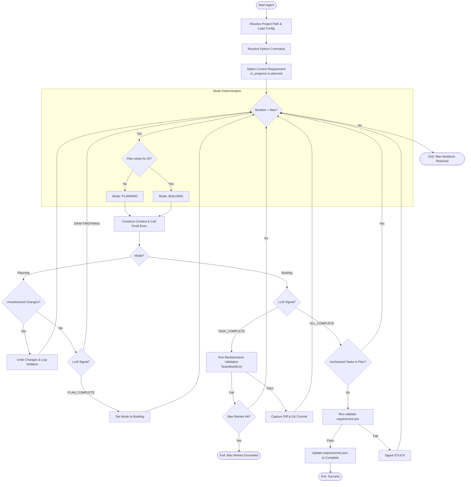

# Felix Execution Flow

This document provides a detailed breakdown of how the Felix agent executes requirements, including mode transitions, validation gates, and error handling.

---

## High-Level Overview

Felix follows a deterministic loop with explicit mode transitions:

```
Requirements → Planning Mode → Building Mode → Validation → Complete
     ↓              ↓                ↓              ↓           ↓
  specs/*.md    plan-*.md      git commits    tests pass   status:complete
```

Each iteration is atomic: it loads fresh context, executes one step, validates the result, and updates artifacts before proceeding.

---

## Detailed Execution Flow



_If the diagram doesn't render, see [Felix-flow.png](../img/Felix-flow.png)_

---

## Phase Descriptions

### 1. Initialization & Context Gathering

**Purpose**: Set up execution environment and load requirement context.

**Steps**:

1. Resolve project path and load `..felix/config.json`
2. Resolve Python executable (for validation scripts)
3. Load `..felix/requirements.json` and select next requirement:
   - Prefer `in_progress` status
   - Fall back to first `planned` requirement
   - Exit if none available

**Context Assembly**:
The agent constructs a comprehensive context for the LLM:

- `AGENTS.md` - How to run/test the project
- `specs/S-XXXX-requirement.md` - Current requirement specification
- `CONTEXT.md` - Product context, tech stack, standards
- `..felix/requirements.json` - Status of all requirements
- `runs/*/plan-S-XXXX.md` - Plan for current requirement (if in building mode)
- Current requirement ID and output path for artifacts

**Artifacts Created**:

- `runs/<timestamp>/` - New run directory
- `runs/<timestamp>/requirement_id.txt` - Which requirement is being worked on

---

### 2. Planning Mode & Guardrails

**Purpose**: Generate or refine implementation plans without modifying code.

#### Mode Selection

Planning mode is selected when:

- No plan file exists for the current requirement: `runs/*/plan-S-XXXX.md`
- Plan content is too short (< 50 characters) indicating a stub

#### Planning Workflow

1. **Load Prompt**: Use `..felix/prompts/planning.md` template
2. **Context Injection**: Add project context, specs, and requirements status
3. **LLM Execution**: Call agent executable (e.g., `droid exec`)
4. **Output Capture**: Save LLM response to `runs/<timestamp>/output.log`

#### Guardrail Enforcement

**Git State Snapshot** (before LLM execution):

```powershell
$gitStateBefore = @{
    CommitHash     = git rev-parse HEAD
    ModifiedFiles  = git diff --name-only HEAD
    UntrackedFiles = git ls-files --others --exclude-standard
}
```

**Allowed Changes** (whitelist):

- `runs/` - Run artifacts and plans
- `..felix/state.json` - Execution state
- `..felix/requirements.json` - Requirement updates

**Violation Detection**:
After LLM execution, check for unauthorized changes:

- New commits: `git rev-parse HEAD` differs from snapshot
- Modified files: Changes outside allowed patterns
- New files: Untracked files outside allowed patterns

**Violation Response**:

```powershell
# Revert commit
git reset --soft $BeforeCommitHash

# Revert file changes
git checkout HEAD -- <unauthorized-file>

# Remove unauthorized new files
Remove-Item <unauthorized-file>

# Log violation
# Continue to next iteration
```

**Why This Matters**: Planning mode must not pollute the codebase with half-baked implementations. The plan is disposable; the code is not.

#### Planning Signals

The LLM can emit three signals during planning:

1. **`<promise>PLAN_DRAFT</promise>`**
   - Initial plan created
   - Continues iteration for self-review

2. **`<promise>PLAN_REFINING</promise>`**
   - Plan needs revision
   - Continues iteration loop

3. **`<promise>PLAN_COMPLETE</promise>`**
   - Plan passes self-review
   - Agent transitions to building mode
   - Next iteration starts implementation

**Self-Review Loop**: The planning prompt includes criteria for the LLM to review its own plan against:

- Philosophy alignment
- Tech stack appropriateness
- Simplicity and maintainability
- Scope boundaries
- "Don't assume not implemented" check

---

### 3. Building Mode & Backpressure

**Purpose**: Implement plan tasks one at a time with validation gates.

#### Building Workflow

1. **Load Context**: Include the plan from `runs/*/plan-S-XXXX.md`
2. **Task Selection**: LLM picks most important unchecked task
3. **Implementation**: Make code changes
4. **Signal**: Emit `<promise>TASK_COMPLETE</promise>`
5. **Validation**: Backpressure runs before commit is allowed

#### Backpressure Validation

**What is Backpressure?**
Automated validation commands (tests, builds, lints) that must pass before any code is committed.

**Command Sources** (in priority order):

1. `..felix/config.json` → `backpressure.commands` array (explicit configuration)
2. `AGENTS.md` → Parsed from "## Run Tests", "## Build", "## Lint" sections

**Parsing AGENTS.md**:
The agent extracts commands from code blocks under these headings:

````markdown
## Run Tests

```bash
.\run-test-spec.ps1
```
````

**Execution**:

```powershell
foreach ($command in $backpressureCommands) {
    $output = Invoke-Expression $command 2>&1
    $exitCode = $LASTEXITCODE

    if ($exitCode -ne 0) {
        # Command failed - validation failed
        $validationPassed = $false
    }
}
```

**Special Cases**:

- **Exit code 5** for backend tests = "no tests found" (treated as pass)
- **RemoteException** in npm output (treated as pass if exit code 0)

**On Failure**:

```
Backpressure Failed
    ↓
Retry Count < Max? (default: 3)
    ↓ Yes
Continue to next iteration (LLM fixes issues)
    ↓ No
Mark requirement as "blocked"
Exit with code 2
```

**On Success**:

```powershell
# Capture git diff
git diff --cached > runs/<timestamp>/diff.patch

# Commit changes
git commit -m "Felix (S-XXXX): <task description>"

# Continue to next iteration
```

**Why This Matters**: Backpressure prevents the agent from breaking existing functionality. Tests are not optional—they are the steering mechanism.

#### Building Signals

1. **`<promise>TASK_COMPLETE</promise>`**
   - One task finished
   - Triggers backpressure validation
   - Commits if validation passes
   - Continues loop

2. **`<promise>ALL_COMPLETE</promise>`**
   - All plan tasks checked off
   - Triggers final requirement validation
   - Exits on success or continues on failure

---

### 4. Final Validation & Completion

**Purpose**: Verify the requirement fully meets its specification.

#### Internal Verification

Before running validation, check plan for unchecked tasks:

```powershell
$planContent = Get-Content "runs/*/plan-S-XXXX.md" -Raw
$uncheckedTasks = ($planContent | Select-String '- \[ \]').Matches.Count

if ($uncheckedTasks -gt 0) {
    # LLM lied about completion - continue iteration
    continue
}
```

#### Requirement Validation

**Script**: `scripts/validate-requirement.ps1`

**Purpose**: Run acceptance criteria from the spec file as executable tests.

**How It Works**:

1. Reads `specs/S-XXXX-requirement.md`
2. Finds "## Validation Criteria" or "## Acceptance Criteria" section
3. Parses checkbox items with commands:
   ```markdown
   - [ ] Tests pass: `pytest` (exit code 0)
   - [ ] Lint clean: `npm run lint` (exit code 0)
   ```
4. Executes each command
5. Verifies expected outcomes (exit codes, status codes, output patterns)

**Exit Codes**:

- `0` - All criteria passed
- `1` - One or more criteria failed
- `2` - Invalid arguments or requirement not found

**On Validation Pass**:

```powershell
# Update requirements.json
Update-RequirementStatus -RequirementId "S-XXXX" -NewStatus "complete"

# Update state
$state.status = "complete"
$state | ConvertTo-Json | Set-Content "..felix/state.json"

# Exit success
exit 0
```

**On Validation Failure**:

```
Validation Failed
    ↓
Signal <promise>STUCK</promise>
    ↓
Retry Count < Max? (default: 2 total attempts)
    ↓ Yes
Continue to next iteration (LLM fixes issues)
    ↓ No
Mark requirement as "blocked"
Exit with code 3
```

**Why Two Retry Limits?**

- **Backpressure retries** (code 2): For implementation issues caught by tests
- **Validation retries** (code 3): For specification issues caught by acceptance criteria

Both types of blocking require manual intervention to unblock.

---

## Exit Codes Reference

| Code  | Meaning            | Recovery                                                   |
| ----- | ------------------ | ---------------------------------------------------------- |
| **0** | Success            | Requirement complete and validated                         |
| **1** | General Error      | Check logs, fix issue, restart                             |
| **2** | Backpressure Block | Fix tests, reset status to "planned" in requirements.json  |
| **3** | Validation Block   | Fix acceptance criteria or code, reset status to "planned" |

### Unblocking Requirements

When a requirement is marked as "blocked" (exit code 2 or 3):

1. **Identify the issue**:
   - Check `runs/<timestamp>/backpressure.log` (code 2)
   - Check `runs/<timestamp>/report.md` (code 3)
   - Review failed command output

2. **Fix the issue**:
   - Fix failing tests
   - Fix validation criteria
   - Fix implementation bugs

3. **Manually unblock**:

   ```json
   // ..felix/requirements.json
   {
     "id": "S-XXXX",
     "status": "planned" // Change from "blocked" to "planned"
   }
   ```

4. **Restart agent**: It will pick up the unblocked requirement

---

## State Management

### ..felix/state.json

**Purpose**: Minimal control state for agent execution.

**Schema**:

```json
{
  "current_requirement_id": "S-XXXX",
  "last_run_id": "2026-01-27T14-30-00",
  "last_mode": "building",
  "last_iteration_outcome": "success",
  "current_iteration": 5,
  "status": "running",
  "validation_retry_count": 0,
  "blocked_task": null,
  "updated_at": "2026-01-27T14:35:00Z"
}
```

**Who Updates**:

- Agent writes on each iteration
- Backend reads for monitoring

### ..felix/requirements.json

**Purpose**: Central registry of requirements and work state.

**Schema**:

```json
{
  "requirements": [
    {
      "id": "S-0001",
      "title": "Feature Name",
      "spec_path": "specs/S-0001-feature-name.md",
      "status": "complete",
      "dependencies": [],
      "last_run_id": "2026-01-27T14-30-00",
      "updated_at": "2026-01-27"
    }
  ]
}
```

**Status Values**:

- `draft` - Not ready for work
- `planned` - Ready to be worked on
- `in_progress` - Currently being worked on
- `complete` - Finished and validated
- `blocked` - Cannot proceed (requires manual intervention)

---

## Iteration Artifacts

Each iteration creates a run directory in `runs/` named from the requirement, timestamp, and iteration:

```
runs/S-0001-20260224-164140-it7/
├── requirement_id.txt          # Which requirement (e.g., "S-0001")
├── output.log                  # Raw LLM output
├── report.md                   # Iteration summary (mode, success, timestamp)
├── plan-S-0001.md             # Plan snapshot (if building mode)
├── diff.patch                  # Git diff (if commit made)
├── backpressure.log           # Validation output (if backpressure ran)
├── blocked-task.md            # Block details (if backpressure failed)
├── guardrail-violation.md     # Violation log (if planning guardrails triggered)
└── max-retries-exceeded.md    # Max retries report (if blocked)
```

**Audit Trail**: These artifacts provide complete traceability of every decision and change made by the agent.

---

## Related Documentation

- [Artifacts](FELIX_EXPLAINED.md) - Durable memory, plans, and artifact lifecycle
